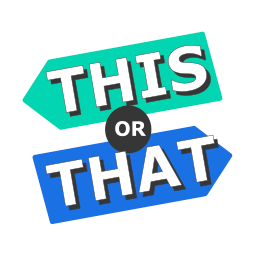

# this-or-that

## the [docs](docs/index.md)

"This or That" is an online tool to make group decisions. 
Each participant of the voting can make votes based on image by selecting one of two displayed images.

## Requirements
### Server
 * Java 8
 * JBoss / Wildfly
 * Maven
 * MongoDB
 
 ### Client
 * NodeJS
 * NPM